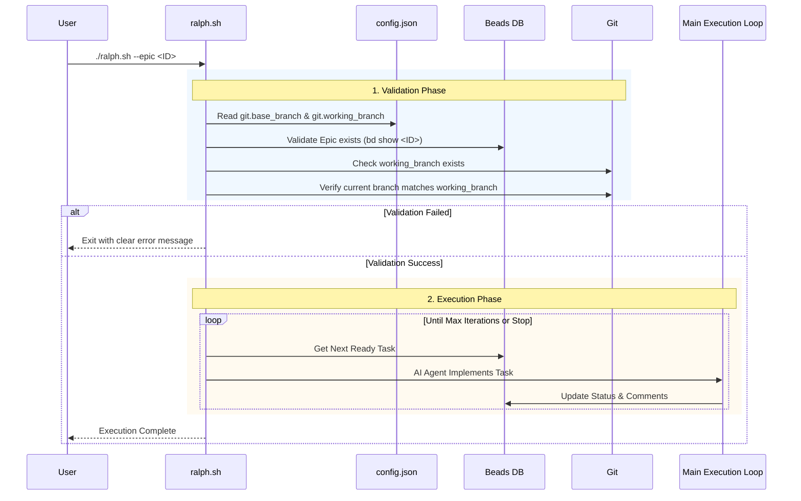

# Ralph Autonomous Execution Flow

This diagram illustrates the simplified autonomous Ralph execution flow with direct validation and configuration-based branch management.

## Key Changes from Previous Workflow

1. **Direct Validation**: `ralph.sh` now validates Epic existence and branch state directly (no Setup Agent). Configuration is read from `config.json` which includes required `git.base_branch` and `git.working_branch` fields.

2. **Configuration-Based Branch Management**: Branch configuration is explicit in `config.json`. The script validates that:
   - The `git` section exists with `base_branch` and `working_branch`
   - The `working_branch` exists locally
   - The current branch matches `working_branch`

3. **Simplified Flow**: Setup and Final Review agents have been removed. Epic validation is performed directly via `bd show`, and branch validation uses git commands directly.

4. **Branch Setup**: When using `setup-ralph-loop` workflow, Step 7 creates the working branch from the base branch (if it doesn't exist) and writes the git configuration to `config.json` using the plan title slug for branch naming (`ralph-<plan-title-slug>`).
