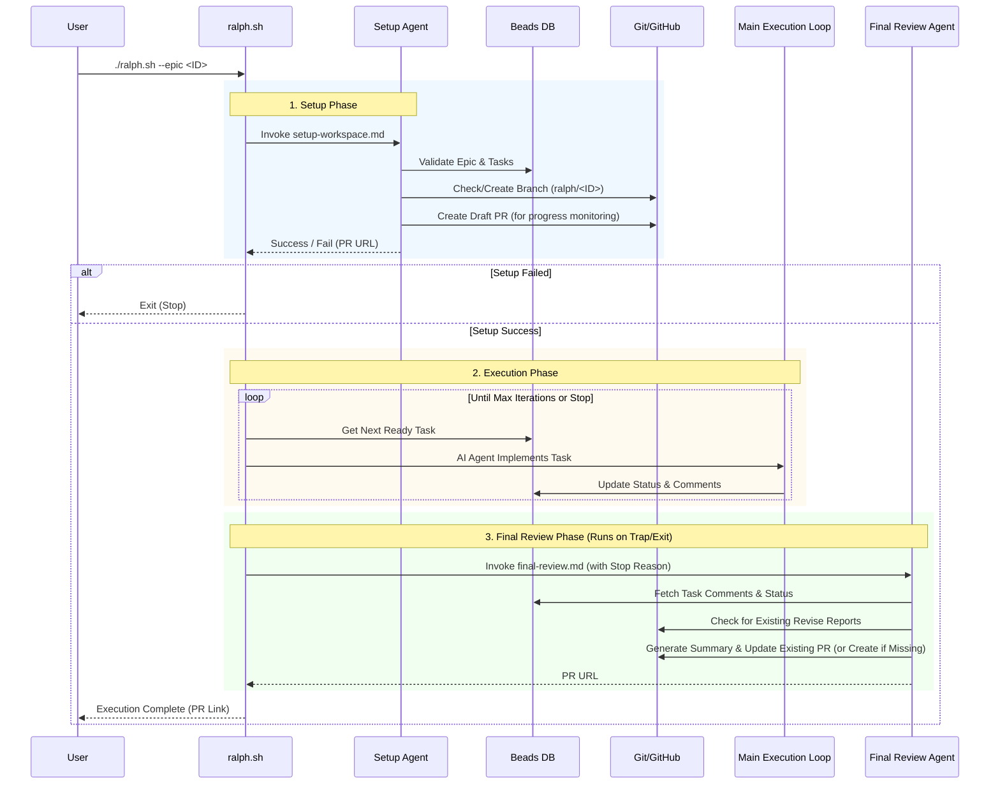

# Ralph Autonomous Execution Flow

This diagram illustrates the new autonomous Ralph execution flow with the integrated Setup and Final Review agents.

## Key Changes from Previous Workflow

1. **Pre-Flight Check (Setup Agent)**: Instead of `ralph.sh` blindly starting, the Setup Agent now intelligently validates the Epic and ensures the git workspace is clean and on the correct branch. It also creates a draft PR at initialization for progress monitoring. If this fails (e.g., Epic doesn't exist), the script stops immediately.

2. **Main Loop**: Remains largely the same (AI tool executing tasks), but relies on the environment prepared by the Setup Agent. The draft PR created during setup provides visibility into execution progress.

3. **Guaranteed Reporting (Final Review Agent)**: Previously, PR creation was a static shell script at the end. Now, a Final Review Agent runs via a trap (meaning it runs even if the script crashes or is interrupted), ensuring the draft PR created during setup is updated with a comprehensive summary of what happened, why it stopped, and any "Revise Reports" generated during the run.
