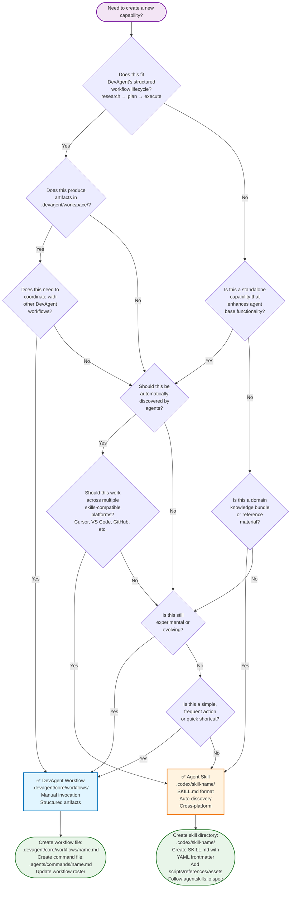
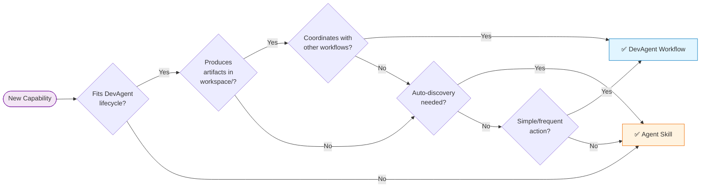

# Workflow vs Skill Decision Tree

Visual decision tree for choosing between DevAgent Workflow and Agent Skill.

## Mermaid Decision Tree

## Simplified Quick Reference

## Decision Criteria Summary

### Choose **DevAgent Workflow** if:
- ✅ Fits DevAgent's structured lifecycle (research → plan → execute)
- ✅ Produces artifacts in `.devagent/workspace/`
- ✅ Coordinates with other DevAgent workflows
- ✅ Simple, frequent actions or shortcuts
- ✅ Still experimental or evolving

### Choose **Agent Skill** if:
- ✅ Standalone capability (not part of DevAgent lifecycle)
- ✅ Should be automatically discovered by agents
- ✅ Domain knowledge bundle or reference material
- ✅ Needs cross-platform portability (Cursor, VS Code, GitHub, etc.)
- ✅ Works better as agent base capability enhancement

## Related Documentation

- Full decision guide: `2025-12-25_workflow-vs-skill-decision-guide.md`
- Agent Skills spec: https://agentskills.io
- DevAgent workflows: `.devagent/core/AGENTS.md`
